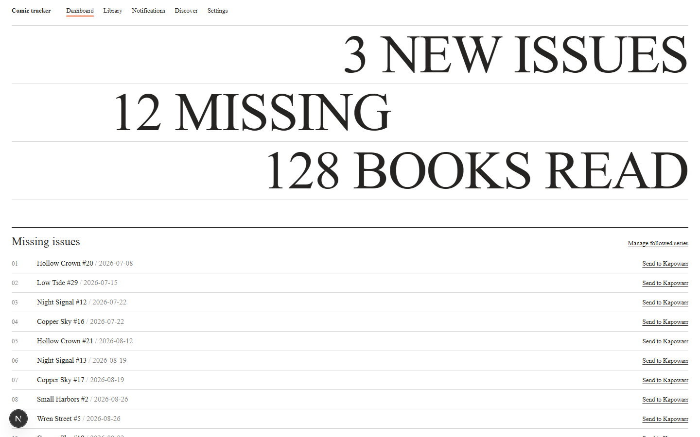

# Gutter

[](https://github.com/terugrit/gutter/actions/workflows/home-assistant-app.yaml)
[](https://www.home-assistant.io/)
[](https://github.com/terugrit/gutter/pkgs/container/gutter)

> Self-hosted comic release tracking for your Komga library.

## Highlights

- Follow selected series from Komga without monitoring your entire library.
- Match series and English-language issues against Metron, with ComicVine as a fallback.
- Receive new-release, weekly-digest, job-failure, and recovery notifications through ntfy.
- Find missing issues and send a volume to Kapowarr only when you choose to download it.
- Track upcoming releases, changed release dates, collection progress, reading activity, and yearly recaps.
- Discover recommendations based on your library without calling metadata services on every page load.
- Run as a Home Assistant OS app or as a standalone Docker Compose service.
- Keep application data in a persistent SQLite database with scheduled backups and portable follow exports.

## Overview

Gutter connects a Komga comic library to Metron, ComicVine, Kapowarr, and ntfy. It keeps a local cache of library and release data, schedules background synchronization jobs, and presents the results in a single web interface.

Gutter is designed for one user on a trusted home network. It does not include authentication, so do not expose it directly to the public internet. Use a trusted reverse proxy with authentication if remote access is required.

### Integrations

| Service | Purpose |
| --- | --- |
| [Komga](https://komga.org/) | Library, owned issues, reading progress, and covers |
| [Metron](https://metron.cloud/) | Primary series metadata and English-language release data |
| [ComicVine](https://comicvine.gamespot.com/api/) | Fallback ComicVine volume lookup for Kapowarr |
| [Kapowarr](https://github.com/Casvt/Kapowarr) | Explicitly requested volume downloads and searches |
| [ntfy](https://ntfy.sh/) | Release, digest, arrival, and job-status notifications |

### Author

Gutter is maintained by [terugrit](https://github.com/terugrit).

## Usage

After starting Gutter:

1. Open the web interface.
2. Go to **Settings**, test the configured services, and select a Komga library.
3. Open **Library** and follow the series you want Gutter to monitor.
4. Review releases and collection status from the dashboard and individual series pages.
5. Use **Download volume** when you want Kapowarr to add and search for a volume.

Gutter never starts a Kapowarr search merely because it detects a release. Downloads require an explicit action.

[](tests/visual/snapshots/desktop-dashboard.png)

The web interface can also be installed on a phone. A full progressive web app installation requires HTTPS or localhost; a plain HTTP LAN address may only create a browser shortcut. Gutter does not cache application data for offline use.

## Installation

### Home Assistant OS

Gutter supports Home Assistant systems using `amd64` and `aarch64`.

1. Open **Settings → Apps → App store** in Home Assistant.
2. Open the repository menu and add:

   ```text
   https://github.com/terugrit/gutter
   ```

3. Find and install **Gutter**.
4. Open the app's **Configuration** tab and enter the service URLs and credentials you use.
5. Under **Network**, choose the host port for **Gutter web interface**. The default is `3000`.
6. Set **Gutter public URL** to an address your phone can reach, including the selected port, such as `http://homeassistant.local:3000`.
7. Start the app and select **Open Web UI**.

Service URLs must be reachable from inside the app container. `localhost` refers to Gutter itself, not another Home Assistant app, container, or computer.

Home Assistant stores the database and default backups in Gutter's persistent app data directory. The app uses a regular exposed port rather than Home Assistant Ingress so Next.js assets and notification links retain stable URLs.

### Docker Compose

Requirements:

- Docker Engine with Docker Compose
- Network access from the Gutter container to each configured service

Clone the repository, create the environment file, and start the service:

```bash
git clone https://github.com/terugrit/gutter.git
cd gutter
cp .env.example .env
docker compose up -d --build
```

Set at least `KOMGA_URL`, `KOMGA_API_KEY`, and `APP_BASE_URL` in `.env` before starting. Then open [http://localhost:3000](http://localhost:3000). The health endpoint is available at [http://localhost:3000/api/health](http://localhost:3000/api/health).

The SQLite database is stored at `/data/app.db` in the `gutter-data` Docker volume and survives container replacement. Update the installation with:

```bash
git pull
docker compose up -d --build
```

## Configuration

Home Assistant users configure these values from the app's Configuration tab. Docker Compose users set the corresponding uppercase names in `.env`.

| Home Assistant option | Environment variable | Purpose |
| --- | --- | --- |
| Komga URL | `KOMGA_URL` | Komga base URL reachable from Gutter |
| Komga API key | `KOMGA_API_KEY` | Komga authentication |
| Metron username | `METRON_USER` | Metron authentication |
| Metron password | `METRON_PASSWORD` | Metron authentication |
| ComicVine API key | `COMICVINE_API_KEY` | Fallback volume lookup |
| Kapowarr URL | `KAPOWARR_URL` | Kapowarr base URL reachable from Gutter |
| Kapowarr API key | `KAPOWARR_API_KEY` | Kapowarr authentication |
| ntfy URL | `NTFY_URL` | ntfy server URL; defaults to `https://ntfy.sh` |
| ntfy topic | `NTFY_TOPIC` | Notification topic |
| ntfy token | `NTFY_TOKEN` | Optional protected-topic token |
| Notification action secret | `ACTION_SECRET` | Optional secret of at least 32 characters for ntfy actions |
| Gutter public URL | `APP_BASE_URL` | Phone-reachable URL used in notification links |
| Time zone | `TZ` | IANA time zone used for schedules and local dates |
| Kapowarr check schedule | `KAPOWARR_CHECK_CRON` | Kapowarr status cron schedule |
| Release check schedule | `RELEASE_CHECK_CRON` | Metron release cron schedule |
| Weekly digest schedule | `WEEKLY_DIGEST_CRON` | Digest notification cron schedule |
| Database backup schedule | `BACKUP_CRON` | SQLite backup cron schedule |
| Backup directory | `BACKUP_DIR` | Optional backup destination |
| Recommendation seed count | `RECOMMENDATION_SEED_COUNT` | Local recommendation seeds, from 3 to 5 |
| Recommendation exclusion days | `RECOMMENDATION_EXCLUSION_DAYS` | Days before a recommendation can repeat, from 1 to 90 |

See [`.env.example`](.env.example) for defaults and examples. Schedule values use standard five-part cron expressions.

## Data, backups, and transfers

Gutter creates an online SQLite backup every night at 03:30 in the configured time zone by default. It keeps the newest seven dated backups. Running the backup again on the same day safely replaces that day's completed backup.

The default backup directory is beside the live database at `/data/backups`. This protects against database mistakes, but not against losing the underlying disk or volume. Docker users can set `BACKUP_DIR=/backups` and bind-mount that path to another disk. Home Assistant users should include Gutter in regular Home Assistant backups.

To restore a full database backup:

1. Stop Gutter.
2. Preserve the current database and its `-wal` and `-shm` sidecar files elsewhere.
3. Place the selected backup at the configured database path without the old sidecar files.
4. Start Gutter.

The **Settings → Follows** section can export and import followed-series data as JSON. Exports include matching IDs, monitoring choices, original follow dates, and skipped issue IDs. They do not contain credentials or notification history and are not a replacement for a full database backup.

## Feedback and contributing

Bug reports and feature requests are welcome in [GitHub Issues](https://github.com/terugrit/gutter/issues). For significant changes, open an issue first so the approach and scope can be discussed before implementation.

### Development

Requirements:

- Node.js 22
- pnpm 9.15.4 through Corepack

Install dependencies and start the development server:

```bash
corepack enable
pnpm install
pnpm dev
```

Open [http://localhost:3000](http://localhost:3000). Development data is stored in `./data/app.db`; schema upgrades run automatically when the application opens.

Before submitting a change, run:

```bash
pnpm lint
pnpm typecheck
pnpm test
```

Visual changes should also pass:

```bash
pnpm test:visual
```

The visual suite uses port `3001`, `.next-visual`, and an isolated test database. On Windows, standalone production packaging may require Developer Mode or administrator privileges because Next.js creates symbolic links. Docker and GitHub Actions build the production package in Linux.

### Publishing the Home Assistant app

Before publishing an update, change the version in `gutter/config.yaml` and document it in `gutter/CHANGELOG.md`. Merging to `main` runs the Home Assistant app linter and publishes matching `amd64` and `aarch64` images to `ghcr.io/terugrit/gutter`. The GitHub Container Registry package must remain public so Home Assistant can install it.
